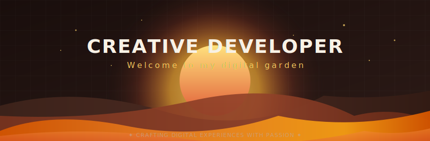

<!-- Welcome to your customized GitHub Profile README! -->
<!-- This file is styled with a Warm Autumn / Sunset color palette. -->
<!-- Make sure to replace placeholders like Aneesh-20 with your actual details! -->

<p align="center">
  
</p>

<h1 align="center">Hi, I'm <a href="https://github.com/Aneesh-20" target="_blank" style="color: #E05A36; text-decoration: none;">Aneesh T Narendaran</a>! 👋</h1>
<p align="center">
  <strong>Creative Software Developer • Tech Enthusiast • Digital Gardener</strong>
</p>

<p align="center">
  <a href="https://linkedin.com/in/YOUR_LINKEDIN" target="_blank">
    
  </a>
  <a href="https://twitter.com/YOUR_TWITTER" target="_blank">
    
  </a>
  <a href="mailto:YOUR_EMAIL@gmail.com">
    
  </a>
  <a href="https://YOUR_PORTFOLIO.com" target="_blank">
    
  </a>
</p>

---

### 🌅 About Me

```text
"The finest digital gardens are watered with daily code commits and styled with passion."
```

- 🍁 **Currently exploring:** Advanced web architectures, modern interactive animations, and responsive system design.
- 💻 **Working on:** Dynamic portfolio components, custom SVG vector designs, and workflow automations.
- 📚 **Learning:** Deepening my knowledge in cloud services, modern backend practices, and WebGL graphics.
- ☕ **Fun fact:** I believe that a clean codebase is as relaxing as a warm cup of coffee on a cozy autumn morning.

---

### 🛠️ Tech Stack & Skills

<div align="center">
  
  #### 💻 Languages
  <table>
    <tr>
      <td align="center" width="110">
        
        <br /><sub><b>JavaScript</b></sub>
      </td>
      <td align="center" width="110">
        
        <br /><sub><b>TypeScript</b></sub>
      </td>
      <td align="center" width="110">
        
        <br /><sub><b>Python</b></sub>
      </td>
      <td align="center" width="110">
        
        <br /><sub><b>HTML5</b></sub>
      </td>
      <td align="center" width="110">
        
        <br /><sub><b>CSS3</b></sub>
      </td>
    </tr>
  </table>

  #### 🚀 Frontend & Backend Frameworks
  <table>
    <tr>
      <td align="center" width="110">
        
        <br /><sub><b>React</b></sub>
      </td>
      <td align="center" width="110">
        
        <br /><sub><b>Next.js</b></sub>
      </td>
      <td align="center" width="110">
        
        <br /><sub><b>Node.js</b></sub>
      </td>
      <td align="center" width="110">
        
        <br /><sub><b>MongoDB</b></sub>
      </td>
      <td align="center" width="110">
        
        <br /><sub><b>PostgreSQL</b></sub>
      </td>
    </tr>
  </table>

  #### 🔧 Tools & DevOps
  <table>
    <tr>
      <td align="center" width="110">
        
        <br /><sub><b>Git</b></sub>
      </td>
      <td align="center" width="110">
        
        <br /><sub><b>Docker</b></sub>
      </td>
      <td align="center" width="110">
        
        <br /><sub><b>Figma</b></sub>
      </td>
      <td align="center" width="110">
        
        <br /><sub><b>VS Code</b></sub>
      </td>
    </tr>
  </table>

</div>

---

### 📊 GitHub Statistics & Performance
<div align="center">
  
  <!-- Stats & Streak Cards side-by-side -->
  <p align="center">
    <a href="https://github.com/Aneesh-20">
      
    </a>
    &nbsp;&nbsp;
    <a href="https://github.com/Aneesh-20">
      
    </a>
  </p>

  <!-- Languages Card -->
  <p align="center">
    <a href="https://github.com/Aneesh-20">
      
    </a>
  </p>

</div>

---

### 🐍 Contribution Grid Snake

Below is a dynamic game grid that tracks GitHub contributions as a walking snake animation!

<p align="center">
  
</p>

*(Refer to the setup instructions below to configure the GitHub Actions workflow that automatically updates this animation daily.)*

---

### ✍️ Recent Blog Posts
<!-- BLOG-POST-LIST:START -->
- 📖 **[Building a Digital Workspace](https://yourblog.com)** — *Creating custom user experiences with vector layouts.*
- 📖 **[The Art of Autumn Aesthetics](https://yourblog.com)** — *Designing cozy, high-contrast themes for programmers.*
<!-- BLOG-POST-LIST:END -->

*(Note: You can automate this list dynamically by utilizing the popular `blog-post-workflow` GitHub Action!)*

---

# 🚀 Setup & Deployment Guide

Follow these steps to deploy this beautiful README to your personal GitHub Profile:

### Step 1: Create Your Profile Repository
1. Log in to GitHub.
2. Create a **New Repository**.
3. Set the repository name to match your exact **GitHub Username** (e.g., if your username is `octocat`, name the repo `octocat`).
   - GitHub will display a message: *"You found a secret! [username]/[username] is a special repository..."*
4. Make sure the repository is **Public**.
5. Check the box to **Initialize this repository with a README**.
6. Click **Create Repository**.

### Step 2: Upload Files
1. Copy the content of this `README.md` file.
2. Edit the `README.md` file inside your new GitHub repository, paste the copied content, and replace all placeholders (like `Aneesh-20`, `YOUR_LINKEDIN`, etc.) with your actual profile links.
3. Upload your custom `banner.svg` file directly to the root of the repository. (This allows the `` tag to display the header correctly on your profile).
4. Commit your changes to the `main` or `master` branch.

### Step 3: Setup the Contribution Snake (Optional)
To enable the animated snake eating your contribution grid, setup a GitHub Actions workflow:
1. In your profile repository, click on the **Actions** tab.
2. Click **Set up a workflow yourself** (or create a file at `.github/workflows/generate-snake.yml`).
3. Paste the following YAML configuration:

```yaml
name: Generate Snake Animation

on:
  # Run automatically every 24 hours
  schedule:
    - cron: "0 */24 * * *"
  
  # Allow manual runs from the Actions tab
  workflow_dispatch:
  
  # Run on every push to the main branch
  push:
    branches:
    - main

jobs:
  generate:
    permissions:
      contents: write
    runs-on: ubuntu-latest
    timeout-minutes: 5
    
    steps:
      # Generates a snake game from a github user contribution graph
      - name: Generate github-contribution-grid-snake.svg
        uses: Platane/snk/svg-only@v3
        with:
          github_user_name: ${{ github.repository_owner }}
          outputs: |
            dist/github-contribution-grid-snake.svg
            dist/github-contribution-grid-snake-dark.svg?palette=github-dark
          
      # Push the svg files to the 'output' branch
      - name: Push github-contribution-grid-snake.svg to the Output Branch
        uses: crazy-max/ghaction-github-pages@v3.1.0
        with:
          target_branch: output
          build_dir: dist
        env:
          GITHUB_TOKEN: ${{ secrets.GITHUB_TOKEN }}
```

4. Commit the workflow file.
5. Go to the **Actions** tab, select **Generate Snake Animation**, and click **Run workflow**. This will run the snake script and create a new branch named `output` containing the generated SVG.
6. The snake image in your README will now dynamically fetch the output from the `output` branch and update itself every day!
